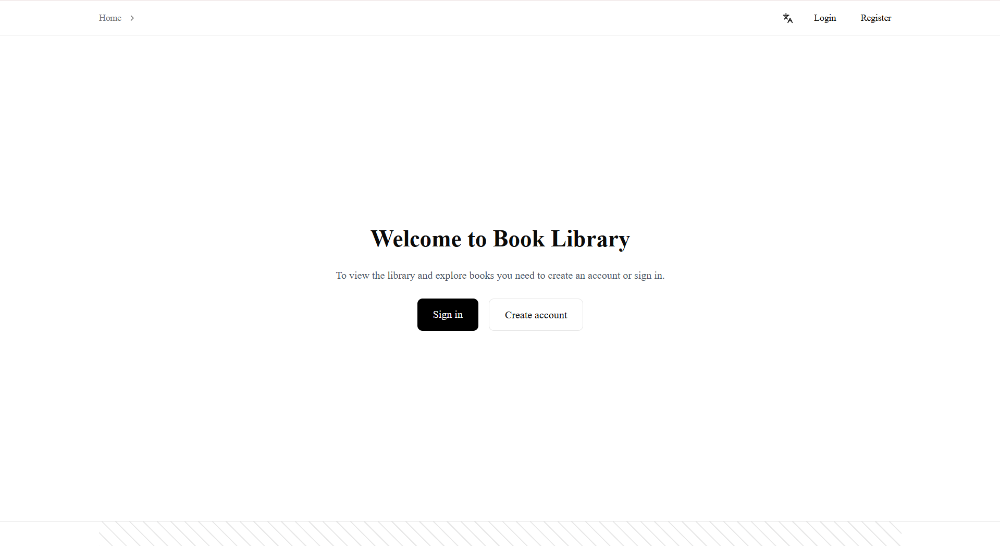
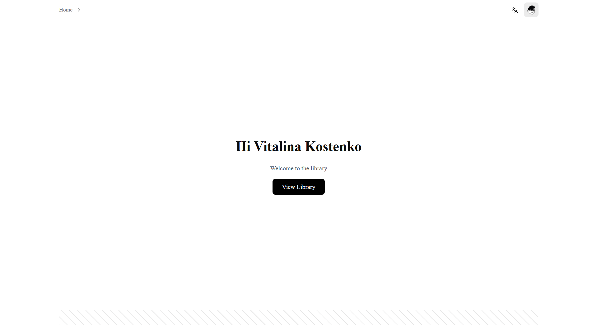
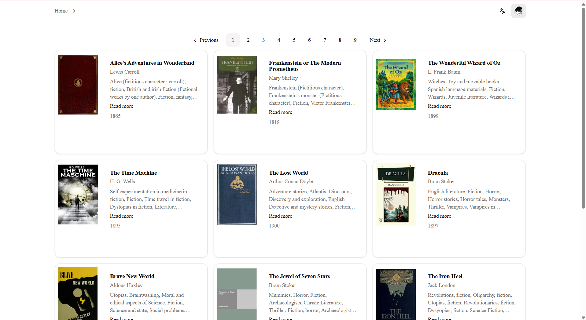
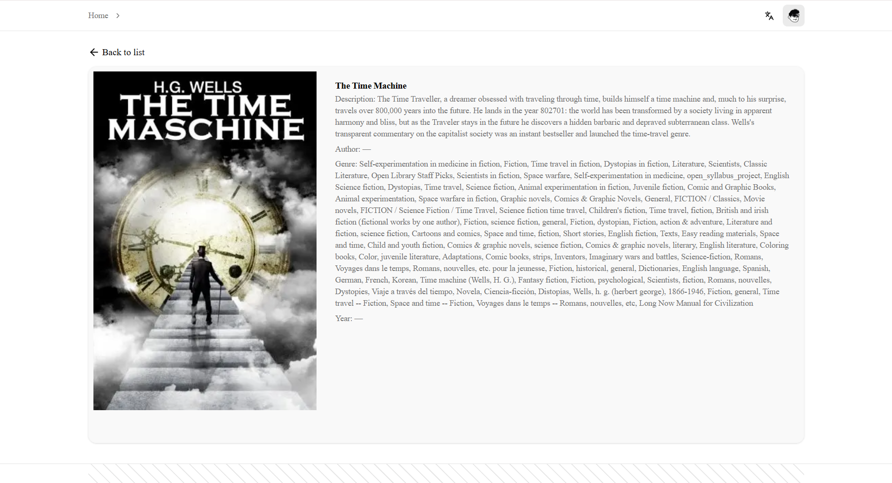

# MyLibrary 📚

**MyLibrary** — це веб-додаток для перегляду бібліотеки книг з підтримкою авторизації користувачів та багатомовного інтерфейсу.

Користувач може створити акаунт, увійти в систему та переглядати каталог книг, отриманих з **Open Library API**.

Проєкт розроблений як навчальний **full-stack Next.js application** з використанням сучасних frontend технологій.

🚀 Основні функціональні можливості

🔒 Автентифікація користувачів
Додаток має захищені роути. Для доступу до бібліотеки користувач повинен мати обліковий запис.

Сторінка входу: Зареєстровані користувачі можуть увійти, використовуючи свій Email та пароль.


Реєстрація: Нові користувачі можуть створити обліковий запис, заповнивши просту форму.


Стартова сторінка: Користувачі, які не увійшли в систему, бачать вітальне вікно з пропозицією авторизуватися.




Вітання користувача: Після успішного входу додаток вітає користувача персоналізованим повідомленням.




### 📚 Book Library

* перегляд списку книг
* сторінка деталей книги
* отримання даних з Open Library API
* пагінація

Після авторизації користувач отримує повний доступ до функціоналу бібліотеки.

Головна сторінка бібліотеки: Відображає список книг у вигляді карток. Реалізовано зручну навігацію та пагінацію для перегляду великої кількості книг.




Детальна інформацію про книгу: Користувач може натиснути на книгу, щоб відкрити сторінку з детальним описом, автором, жанром та роком видання.




### 🌍 Internationalization (i18n)

Додаток підтримує **дві мови інтерфейсу:**

* 🇬🇧 English
* 🇩🇪 German

Мова змінюється через роутинг:

```
/en/items
/de/items
```

### 🎨 UI

* адаптивний дизайн
* компоненти **shadcn/ui**
* стилізація через **Tailwind CSS**

### 🧪 Testing

* e2e тести з **Playwright**

---

# 🛠 Tech Stack

| Technology       | Description        |
| ---------------- | ------------------ |
| Next.js          | React framework    |
| TypeScript       | Static typing      |
| Tailwind CSS     | Styling            |
| shadcn/ui        | UI components      |
| Zustand          | State management   |
| NextAuth         | Authentication     |
| Supabase         | Database           |
| Playwright       | End-to-end testing |
| Open Library API | Book data          |

---

# 📦 Installation

Clone repository

```bash
git clone https://github.com/vitalina-kostenko-js/MyLibrary.git
```

Go to project folder

```bash
cd MyLibrary
```

Install dependencies

```bash
npm install
```

Run development server

```bash
npm run dev
```

Application will run on

```
http://localhost:3000
```

---

# 📁 Project Structure

```
src/
├── app/
│   ├── (web)/                    # маршрутизація Next.js
│   │   ├── layout.tsx
│   │   ├── not-found.tsx
│   │   └── [locale]/
│   │       ├── (auth)/           # sign-in, sign-up
│   │       ├── (public)/         # головна для гостей
│   │       ├── items/            # каталог, пошук, деталі книги
│   │       └── ...
│   ├── modules/                  # складені екрани / сторінкова логіка
│   ├── widgets/                  # самодостатні блоки UI
│   ├── features/                 # фічі (auth-form, item-details, …)
│   ├── entities/                 # API, інтеграції (books-api, auth, …)
│   └── shared/                   # ui, hooks, lib, store, interfaces, providers, assets, …
├── config/                       # env, styles, …
└── pkg/                          # i18n, (theme/ui за потреби)
```

---

# 📡 API

Проєкт використовує **Open Library API**.

Example endpoint:

```
https://openlibrary.org/subjects/science_fiction.json
```

Доступні дані:

* title
* author
* cover image
* subjects
* description
* work id

---

# 🧪 Testing

Run Playwright tests

```bash
npx playwright test
```

Приклади тестів:

* список книг відображається
* перехід на сторінку книги
* перевірка пагінації

---

# 👩‍💻 Author

**Vitalina Kostenko**

GitHub
[https://github.com/vitalina-kostenko-js](https://github.com/vitalina-kostenko-js)

---

# 📄 License

This project was created for educational purposes.
