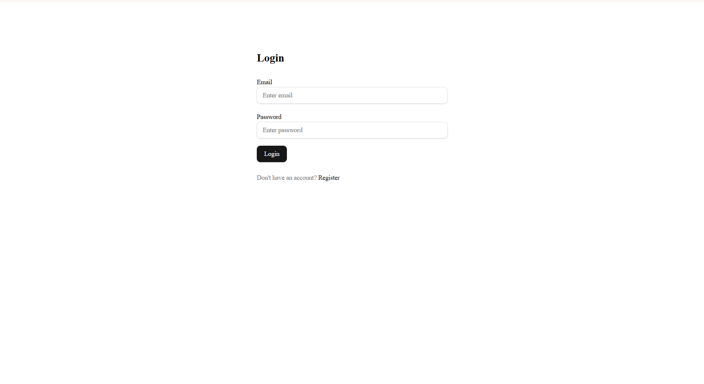
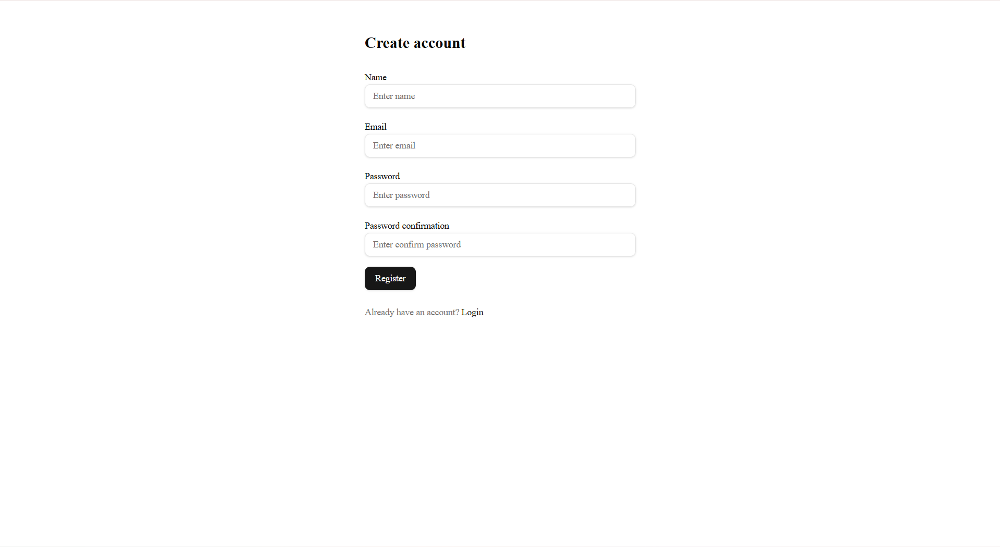

# MyLibrary 📚

**MyLibrary** — це веб-додаток для перегляду бібліотеки книг з підтримкою авторизації користувачів та багатомовного інтерфейсу.

Користувач може створити акаунт, увійти в систему та переглядати каталог книг, отриманих з **Open Library API**.

Проєкт розроблений як навчальний **full-stack Next.js application** з використанням сучасних frontend технологій.

---

# 🚀 Features

### 🔐 Authentication

* реєстрація користувача
* логін
* збереження сесії
* редірект після входу

  Gemini said
Ось оновлений файл README.md для вашого репозиторію. Я проаналізував надані вами скріншоти та посилання на репозиторій, щоб структурувати опис та додати зображення у відповідні розділи.

Для того, щоб скріншоти відображалися, вам потрібно виконати наступні кроки:

Створіть папку з назвою assets у кореневій директорії вашого проекту (там же, де знаходиться файл README.md).

Перейменуйте надані скріншоти відповідно до назв, які я використав у коді нижче (наприклад, login-page.png, library-page.png тощо) або скоригуйте шляхи в коді.

Завантажте ці зображення у створену папку assets.

Скопіюйте наведений нижче текст і замініть ним вміст вашого поточного файлу README.md.

MyLibrary - Веб-додаток "Книжкова бібліотека"
Цей проект є веб-додатком для керування особистою бібліотекою книг. Він дозволяє користувачам реєструватися, входити в систему, переглядати колекцію книг з пагінацією та переглядати детальну інформацію про кожну книгу.

Проект розроблено з використанням сучасних технологій на React для створення зручного та інтуїтивно зрозумілого інтерфейсу.

🚀 Основні функціональні можливості
🔒 Автентифікація користувачів
Додаток має захищені роути. Для доступу до бібліотеки користувач повинен мати обліковий запис.

Сторінка входу: Зареєстровані користувачі можуть увійти, використовуючи свій Email та пароль.




Реєстрація: Нові користувачі можуть створити обліковий запис, заповнивши просту форму.




Стартова сторінка: Користувачі, які не увійшли в систему, бачать вітальне вікно з пропозицією авторизуватися.


Вітання користувача: Після успішного входу додаток вітає користувача персоналізованим повідомленням.


### 📚 Book Library

* перегляд списку книг
* сторінка деталей книги
* отримання даних з Open Library API
* пагінація

Після авторизації користувач отримує повний доступ до функціоналу бібліотеки.

Головна сторінка бібліотеки: Відображає список книг у вигляді карток. Реалізовано зручну навігацію та пагінацію для перегляду великої кількості книг.


Детальна інформацію про книгу: Користувач може натиснути на книгу, щоб відкрити сторінку з детальним описом, автором, жанром та роком видання.


### 🌍 Internationalization (i18n)

Додаток підтримує **дві мови інтерфейсу:**

* 🇬🇧 English
* 🇩🇪 German

Мова змінюється через роутинг:

```
/en/items
/de/items
```

### 🎨 UI

* адаптивний дизайн
* компоненти **shadcn/ui**
* стилізація через **Tailwind CSS**

### 🧪 Testing

* e2e тести з **Playwright**

---

# 🛠 Tech Stack

| Technology       | Description        |
| ---------------- | ------------------ |
| Next.js          | React framework    |
| TypeScript       | Static typing      |
| Tailwind CSS     | Styling            |
| shadcn/ui        | UI components      |
| Zustand          | State management   |
| NextAuth         | Authentication     |
| Supabase         | Database           |
| Playwright       | End-to-end testing |
| Open Library API | Book data          |

---

# 📦 Installation

Clone repository

```bash
git clone https://github.com/vitalina-kostenko-js/MyLibrary.git
```

Go to project folder

```bash
cd MyLibrary
```

Install dependencies

```bash
npm install
```

Run development server

```bash
npm run dev
```

Application will run on

```
http://localhost:3000
```

---

# 📁 Project Structure

```
app/
 ├ [locale]/
 │   ├ items/
 │   ├ auth/
 │   └ layout.tsx
 │
shared/
 ├ hooks
 ├ services
 ├ interfaces
 ├ utils
 └ ui
```

---

# 📡 API

Проєкт використовує **Open Library API**.

Example endpoint:

```
https://openlibrary.org/subjects/science_fiction.json
```

Доступні дані:

* title
* author
* cover image
* subjects
* description
* work id

---

# 🧪 Testing

Run Playwright tests

```bash
npm run test
```

Приклади тестів:

* список книг відображається
* перехід на сторінку книги
* перевірка пагінації

---

# 👩‍💻 Author

**Vitalina Kostenko**

GitHub
[https://github.com/vitalina-kostenko-js](https://github.com/vitalina-kostenko-js)

---

# 📄 License

This project was created for educational purposes.
